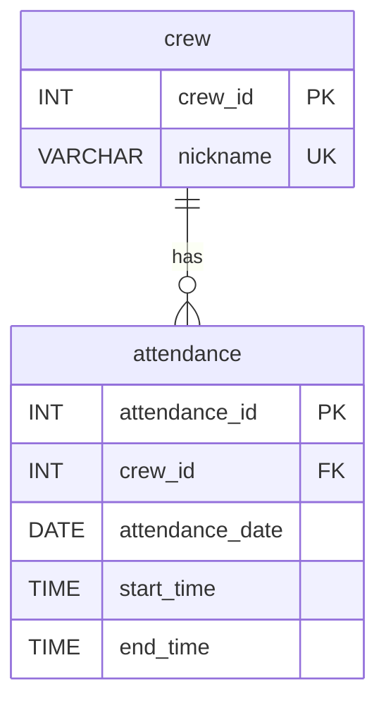

# DB Practice Answers

## 전제

- 문제 1~4를 반영한 뒤에는 `attendance.nickname`을 제거하고, `crew` 테이블을 분리한 상태를 기준으로 답을 작성했다.
- 문제 6~9의 `어셔`, `주니`, `아론`은 제공된 초기 `attendance` 샘플에는 없으므로, 이미 `crew` 테이블에 등록된 크루라고 가정했다.
- 만약 `crew` 테이블에도 해당 크루가 없다면, 먼저 `crew`에 크루 정보를 추가한 뒤 아래 쿼리를 실행해야 한다.

## 1. 테이블 생성하기 (CREATE TABLE)

중복된 데이터는 `nickname` 컬럼이다. `crew_id`와 `nickname`은 크루 자체의 정보이므로 `crew` 테이블로 분리하는 것이 적절하다.

크루 정보 추출:

```sql
SELECT DISTINCT `crew_id`, `nickname`
FROM `attendance`
ORDER BY `crew_id`;
```

`crew` 테이블 생성:

```sql
CREATE TABLE `crew` (
  `crew_id` INT NOT NULL AUTO_INCREMENT,
  `nickname` VARCHAR(50) NOT NULL,
  PRIMARY KEY (`crew_id`)
);
```

`attendance`에서 크루 정보 추출 후 삽입:

```sql
INSERT INTO `crew` (`crew_id`, `nickname`)
SELECT DISTINCT `crew_id`, `nickname`
FROM `attendance`
ORDER BY `crew_id`;
```

## 2. 테이블 컬럼 삭제하기 (ALTER TABLE)

`crew` 테이블을 만들면 `attendance`에서 불필요해지는 컬럼은 `nickname`이다.

```sql
ALTER TABLE `attendance`
DROP COLUMN `nickname`;
```

## 3. 외래키 설정하기

```sql
ALTER TABLE `attendance`
ADD CONSTRAINT `fk_attendance_crew`
FOREIGN KEY (`crew_id`)
REFERENCES `crew` (`crew_id`)
ON UPDATE CASCADE
ON DELETE RESTRICT;
```

## 4. 유니크 키 설정

```sql
ALTER TABLE `crew`
ADD CONSTRAINT `uk_crew_nickname`
UNIQUE (`nickname`);
```

## 5. 크루 닉네임 검색하기 (LIKE)

3월 4일에 출석한 크루 중 닉네임 첫 글자가 `디`인 크루 조회:

```sql
SELECT c.`nickname`
FROM `attendance` AS a
INNER JOIN `crew` AS c ON c.`crew_id` = a.`crew_id`
WHERE a.`attendance_date` = '2025-03-04'
  AND c.`nickname` LIKE '디%';
```

## 6. 출석 기록 확인하기 (SELECT + WHERE)

어셔의 3월 6일 출석 기록 존재 여부 확인:

```sql
SELECT a.*
FROM `attendance` AS a
WHERE a.`crew_id` = (
  SELECT c.`crew_id`
  FROM `crew` AS c
  WHERE c.`nickname` = '어셔'
)
AND a.`attendance_date` = '2025-03-06';
```

결과가 0행이면 기록이 누락된 것이다.

## 7. 누락된 출석 기록 추가 (INSERT)

```sql
INSERT INTO `attendance` (`crew_id`, `attendance_date`, `start_time`, `end_time`)
VALUES (
  (
    SELECT c.`crew_id`
    FROM `crew` AS c
    WHERE c.`nickname` = '어셔'
  ),
  '2025-03-06',
  '09:31',
  '18:01'
);
```

## 8. 잘못된 출석 기록 수정 (UPDATE)

```sql
UPDATE `attendance`
SET `start_time` = '10:00'
WHERE `crew_id` = (
  SELECT c.`crew_id`
  FROM `crew` AS c
  WHERE c.`nickname` = '주니'
)
AND `attendance_date` = '2025-03-12';
```

## 9. 허위 출석 기록 삭제 (DELETE)

```sql
DELETE FROM `attendance`
WHERE `crew_id` = (
  SELECT c.`crew_id`
  FROM `crew` AS c
  WHERE c.`nickname` = '아론'
)
AND `attendance_date` = '2025-03-12';
```

## 10. 출석 정보 조회하기 (JOIN)

닉네임과 출석 정보를 함께 조회:

```sql
SELECT
  c.`nickname`,
  a.`attendance_date`,
  a.`start_time`,
  a.`end_time`
FROM `attendance` AS a
INNER JOIN `crew` AS c ON c.`crew_id` = a.`crew_id`
ORDER BY a.`attendance_date`, c.`nickname`;
```

특정 닉네임만 보고 싶다면 `WHERE c.nickname = '검프'` 같은 조건을 추가하면 된다.

## 11. nickname으로 쿼리 처리하기 (서브 쿼리)

닉네임으로 `crew_id`를 찾아 출석 기록 조회:

```sql
SELECT *
FROM `attendance`
WHERE `crew_id` = (
  SELECT `crew_id`
  FROM `crew`
  WHERE `nickname` = '검프'
)
ORDER BY `attendance_date`;
```

## 12. 가장 늦게 하교한 크루 찾기

3월 5일 가장 늦게 하교한 크루의 닉네임과 하교 시각 조회:

```sql
SELECT
  c.`nickname`,
  a.`end_time`
FROM `attendance` AS a
INNER JOIN `crew` AS c ON c.`crew_id` = a.`crew_id`
WHERE a.`attendance_date` = '2025-03-05'
ORDER BY a.`end_time` DESC
LIMIT 1;
```

제공된 데이터 기준 결과는 `네오`, `18:15`다.

## 13. 크루별로 기록된 날짜 수 조회

```sql
SELECT
  c.`nickname`,
  COUNT(a.`attendance_date`) AS `recorded_days`
FROM `crew` AS c
LEFT JOIN `attendance` AS a ON a.`crew_id` = c.`crew_id`
GROUP BY c.`crew_id`, c.`nickname`
ORDER BY c.`crew_id`;
```

## 14. 크루별 등교 기록이 있는 날짜 수 조회

`COUNT(start_time)`은 `NULL`이 아닌 값만 센다.

```sql
SELECT
  c.`nickname`,
  COUNT(a.`start_time`) AS `start_recorded_days`
FROM `crew` AS c
LEFT JOIN `attendance` AS a ON a.`crew_id` = c.`crew_id`
GROUP BY c.`crew_id`, c.`nickname`
ORDER BY c.`crew_id`;
```

## 15. 날짜별로 등교한 크루 수 조회

```sql
SELECT
  `attendance_date`,
  COUNT(DISTINCT `crew_id`) AS `crew_count`
FROM `attendance`
WHERE `start_time` IS NOT NULL
GROUP BY `attendance_date`
ORDER BY `attendance_date`;
```

## 16. 크루별 가장 빠른 등교 시각과 가장 늦은 등교 시각

```sql
SELECT
  c.`nickname`,
  MIN(a.`start_time`) AS `earliest_start_time`,
  MAX(a.`start_time`) AS `latest_start_time`
FROM `crew` AS c
LEFT JOIN `attendance` AS a ON a.`crew_id` = c.`crew_id`
GROUP BY c.`crew_id`, c.`nickname`
ORDER BY c.`crew_id`;
```

## Comment

### 기본키란 무엇이고 왜 필요한가?

기본키는 테이블의 각 레코드를 고유하게 식별하는 값이다. 기본키가 없으면 같은 사람이 같은 날 같은 시간에 기록된 두 행을 구분하기 어렵고, 수정이나 삭제 시 어떤 행을 대상으로 해야 하는지 불명확해진다. 관계형 DB에서 다른 테이블이 안전하게 참조하려면 기준점이 되는 고유 식별자가 필요하다.

### MySQL에서 AUTO_INCREMENT는 왜 필요할까?

매번 사람이 직접 ID를 정하면 중복, 누락, 충돌이 쉽게 생긴다. `AUTO_INCREMENT`는 새 행이 들어올 때 DB가 자동으로 고유한 숫자를 부여하므로 입력 실수를 줄이고 기본키 생성 비용을 낮춘다. 특히 여러 사용자가 동시에 데이터를 넣는 상황에서 유용하다.

### end_time에 NULL이 저장될 때 주의할 점은?

`NULL`은 0이나 빈 문자열이 아니라 "값이 없음"을 뜻한다. 그래서 `= NULL`이 아니라 `IS NULL`로 비교해야 하고, 집계 함수에서도 `COUNT(column)`은 `NULL`을 세지 않는다는 점을 주의해야 한다. 프론트엔드에서는 단순히 빈칸으로 둘지, "미퇴실", "기록 없음"처럼 명시적으로 보여줄지 정책을 정해야 한다.

### crew와 attendance 테이블의 관계를 ER 다이어그램으로 시각화해보자. 이 관계를 일상생활의 예시로 비유한다면?



한 명의 크루는 여러 개의 출석 기록을 가질 수 있으므로 `crew`와 `attendance`는 일대다 관계다. 일상생활로 비유하면 "고객 한 명이 여러 주문을 가진다"는 관계와 비슷하다.

### 동시에 100명이 등교 버튼을 누르면 어떤 일이 일어날까? 트랜잭션과 ACID로 설명해보자.

동시에 요청이 몰리면 같은 사용자의 기록이 중복 저장되거나, 일부 컬럼만 반영된 반쪽짜리 데이터가 남을 수 있다. 트랜잭션은 이런 작업을 하나의 논리 단위로 묶어서 전부 성공하거나 전부 실패하게 만든다. `Atomicity`는 출석 기록 저장이 중간까지만 반영되지 않게 하고, `Isolation`은 동시에 처리되는 요청끼리 서로의 중간 상태를 보지 않게 해준다. `Consistency`는 제약조건을 깨지 않는 상태만 남기고, `Durability`는 커밋된 출석 기록이 장애 후에도 유지되게 한다.

### 출석 데이터가 CSV가 아닌 데이터베이스에 저장되는 이유는 무엇일까?

CSV는 단순 저장에는 편하지만 동시 수정, 참조 무결성, 권한 관리, 조건 검색, 집계에 약하다. 여러 명이 동시에 파일을 수정하면 충돌이나 유실이 생기기 쉽고, `crew_id`가 실제 크루를 가리키는지 같은 일관성도 강제하기 어렵다. 반면 DB는 트랜잭션, 인덱스, 제약조건, 권한 제어를 제공해서 운영 데이터 관리에 적합하다.

### NoSQL로 저장한다면 구조가 어떻게 달라지고, 어떤 장단점이 있을까?

MongoDB 같은 문서형 DB라면 아래처럼 크루 문서 안에 출석 배열을 넣는 식으로 설계할 수 있다.

```json
{
  "crewId": 1,
  "nickname": "검프",
  "attendanceRecords": [
    { "date": "2025-03-04", "startTime": "09:45", "endTime": "18:10" },
    { "date": "2025-03-05", "startTime": "09:50", "endTime": "18:05" }
  ]
}
```

장점은 구조 변경이 유연하고, 한 크루의 출석을 통째로 읽기 쉽다는 점이다. 단점은 닉네임 중복 금지나 참조 무결성 같은 규칙을 RDB만큼 강하게 보장하기 어렵고, 날짜별 전체 집계 같은 작업은 스키마 설계에 따라 더 번거로워질 수 있다는 점이다.

### 왜 crew 테이블에서 nickname을 기본키로 하지 않았을까? attendance 테이블에 attendance_id가 존재하는 이유는 무엇일까?

닉네임은 업무적으로 의미 있는 자연키지만, 정책 변경이나 오타 수정으로 바뀔 가능성이 있다. 반면 `crew_id`는 의미가 없는 대리키라서 변경 가능성이 낮고 참조에 안정적이다. `attendance_id`도 같은 이유로 필요하다. `crew_id + attendance_date`로 유일성을 표현할 수는 있어도, 단일 행을 식별하고 수정·삭제·참조하기에는 별도의 대리키가 더 단순하고 안전하다.

### RESTRICT와 CASCADE는 무엇인가?

둘 다 외래키 관계에서 부모 데이터를 수정하거나 삭제할 때 어떻게 처리할지 정하는 규칙이다. `RESTRICT`는 자식 레코드가 남아 있으면 부모 삭제나 수정을 막는다. `CASCADE`는 부모 변경을 자식에게 같이 전파한다. 예를 들어 크루 삭제 시 관련 출석도 함께 삭제하려면 `ON DELETE CASCADE`, 출석 기록이 남아 있는 크루는 삭제하지 못하게 하려면 `ON DELETE RESTRICT`를 쓴다.

### 서브쿼리와 JOIN은 어떤 차이가 있고 언제 유리할까?

두 쿼리는 같은 결과를 낼 수 있지만, 보통 `JOIN`이 실행 계획을 최적화하기 쉽고 여러 컬럼을 함께 가져올 때 자연스럽다. 반면 서브쿼리는 "닉네임으로 crew_id 하나를 찾고 싶다"처럼 문제를 단계적으로 표현할 때 읽기 쉬울 수 있다. 실제 성능은 인덱스와 옵티마이저에 따라 달라지지만, 대량 데이터에서 여러 테이블 컬럼을 같이 활용한다면 대체로 `JOIN`이 더 유리한 경우가 많다.

### attendance 테이블을 완전히 정규화하면 어떤 장점이 있고, 일부 비정규화를 적용하면 어떤 이점이 있을까?

정규화하면 중복 저장이 줄고, 닉네임 변경 시 한 곳만 수정하면 되며, 데이터 불일치 가능성이 낮아진다. 반대로 일부 비정규화로 `attendance`에 닉네임을 같이 저장하면 조회 시 `JOIN` 없이 빠르게 화면을 만들 수 있어 읽기 성능이 좋아질 수 있다. 다만 그만큼 중복과 동기화 비용이 늘어난다.

### 연결 풀링(connection pooling)은 무엇이고 왜 필요한가?

DB 연결은 생성 비용이 큰 자원이다. 요청마다 새 연결을 만들고 닫으면 지연이 커지고 DB 서버도 쉽게 포화된다. 연결 풀링은 미리 연결 여러 개를 만들어 재사용하는 방식이다. 출석 시스템처럼 동시에 많은 요청이 들어오는 환경에서는 응답 속도를 안정화하고 DB 연결 수를 통제하기 위해 필요하다.

### INSERT, UPDATE, DELETE를 하나의 트랜잭션으로 묶는다면 어떻게 작성할 수 있을까? DELETE 도중 오류가 나면 앞선 작업은 어떻게 되어야 할까?

```sql
START TRANSACTION;

INSERT INTO `attendance` (`crew_id`, `attendance_date`, `start_time`, `end_time`)
VALUES (13, '2025-03-06', '09:31', '18:01');

UPDATE `attendance`
SET `start_time` = '10:00'
WHERE `crew_id` = 14
  AND `attendance_date` = '2025-03-12';

DELETE FROM `attendance`
WHERE `crew_id` = 15
  AND `attendance_date` = '2025-03-12';

COMMIT;
```

중간에 오류가 나면 `ROLLBACK`해서 앞서 성공했던 `INSERT`, `UPDATE`까지 모두 취소되어야 한다. 그래야 세 작업이 하나의 작업 단위로 일관되게 반영된다.
